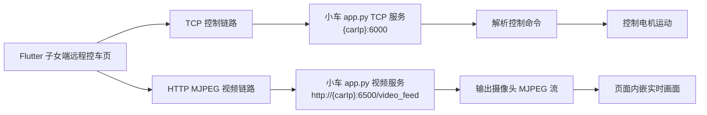
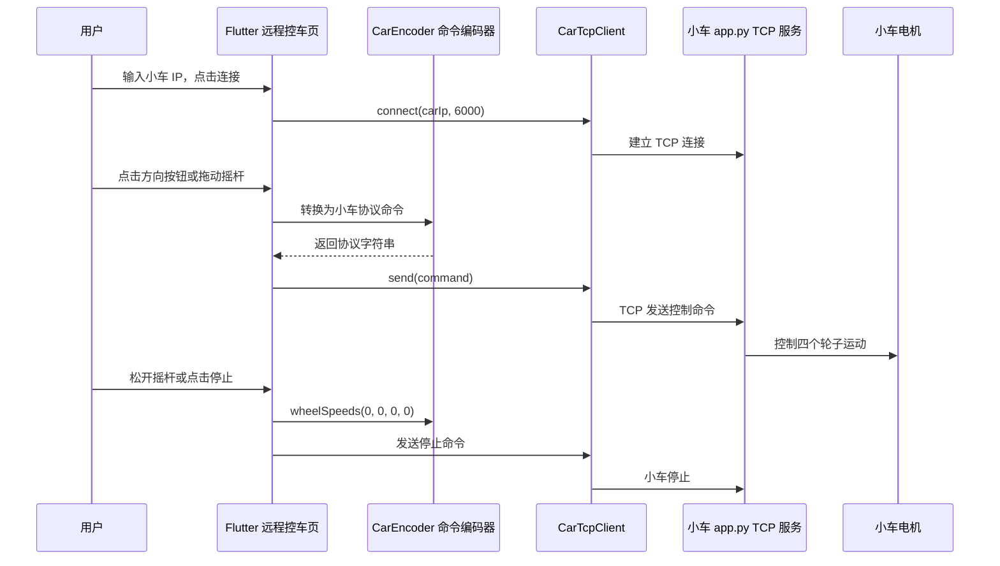

# 子女端远程控车与实时视频实现说明

## 1. 功能概述

子女端远程控车页面用于在移动端直接控制智能小车，并在同一页面查看小车摄像头的实时画面。当前方案采用 **TCP 直连控制 + HTTP MJPEG 视频流** 的双通道设计。

远程控制不经过 SpringBoot 后端，也不再保留 ROS2 网关模式，而是由 Flutter 前端直接连接小车端的 TCP 服务。视频显示也不再通过外部浏览器打开，而是直接嵌入到远程控车页面中。

用户进入子女端远程控车页后，可以完成以下操作：

- 输入或修改小车 IP。
- 连接小车 TCP 控制服务。
- 在页面内查看实时视频。
- 使用方向按钮控制前进、后退、左转、右转、停止和急停。
- 使用圆形虚拟摇杆连续控制小车运动。
- 切换慢速、中速、快速三个速度档位。
- 在高级调试区单独测试四个轮子的速度方向。
- 视频卡住或加载失败时，点击刷新按钮重新拉取视频流。

## 2. 整体架构

远程控车页面主要包含两条通信链路：一条用于控制小车运动，另一条用于显示实时视频。



控制链路和视频链路互相独立：

| 功能 | 协议 | 地址 | 作用 |
| --- | --- | --- | --- |
| 远程控制 | TCP | `{carIp}:6000` | 发送小车运动命令 |
| 实时视频 | HTTP MJPEG | `http://{carIp}:6500/video_feed` | 显示摄像头实时画面 |

这种设计的优点是控制和视频互不影响。即使视频暂时加载失败，只要 TCP 连接正常，仍然可以控制小车；如果控制连接失败，视频也可以单独尝试显示或刷新。

## 3. 远程控制流程

远程控制采用 TCP 直连方式。用户在页面输入小车 IP 后，点击连接按钮，Flutter 会直接连接小车的 `6000` 端口。

例如小车 IP 为：

```text
192.168.160.125
```

则控制连接地址为：

```text
192.168.160.125:6000
```

完整控制流程如下：



控制链路可以概括为：

```text
用户操作
  ↓
Flutter 远程控车页面
  ↓
CarEncoder 编码为小车协议
  ↓
CarTcpClient 通过 TCP 发送
  ↓
小车 app.py 接收并解析
  ↓
电机执行动作
```

## 4. TCP 连接实现

Flutter 前端通过 `CarTcpClient` 管理 TCP socket 连接。连接时会先关闭旧连接，再使用小车 IP 和固定端口 `6000` 建立新连接。

核心逻辑如下：

```dart
_socket = await Socket.connect(
  host,
  port,
  timeout: const Duration(seconds: 8),
);
```

发送控制命令时，将命令字符串转换为 UTF-8 字节并写入 socket：

```dart
socket.add(utf8.encode(message));
await socket.flush();
```

如果连接失败，页面会提示：

```text
小车控制连接失败，请确认 app.py 已启动，6000 端口可访问
```

相关实现文件：

- `mobile/lib/features/child/data/remote_car/car_tcp_client.dart`
- `mobile/lib/features/child/presentation/pages/child_remote_car_page.dart`

## 5. 控制命令编码方式

小车端使用原 smart car demo 的控制协议。前端通过 `CarEncoder` 将用户操作编码成小车可以识别的字符串命令。

命令的大致格式为：

```text
$ + 帧头 + 命令类型 + 数据长度 + 数据内容 + 校验和 + #
```

页面中主要使用以下几种编码方式：

| 编码方法 | 作用 |
| --- | --- |
| `CarEncoder.button(...)` | 发送按钮类命令，例如急停 |
| `CarEncoder.rocker(x, y)` | 原始摇杆协议，当前保留但不是主控制方式 |
| `CarEncoder.wheelSpeeds(...)` | 发送四轮速度命令，是当前主要控制方式 |

当前方案中，方向按钮和圆形摇杆都主要使用 `wheelSpeeds(...)`。这样可以直接控制四个轮子的速度，转向效果更明确，也更方便调试。

相关实现文件：

- `mobile/lib/features/child/data/remote_car/car_encoder.dart`

## 6. 速度档位设计

页面提供三个速度档位：

| 档位 | 数值 |
| --- | ---: |
| 慢速 | 30 |
| 中速 | 60 |
| 快速 | 100 |

默认档位为中速，即：

```text
speed = 60
```

速度档位是全局生效的，不只影响摇杆，也影响方向按钮和高级调试中的四轮速度默认值。

受速度档位影响的操作包括：

- 前进
- 后退
- 左转
- 右转
- 圆形摇杆拖动
- 四轮速度调试默认值

不受速度档位影响的操作包括：

- 停止
- 急停

停止命令始终发送四轮速度为 `0`，急停始终发送刹车命令。

## 7. 方向按钮控制逻辑

页面保留基础控制按钮：

- 前进
- 后退
- 左转
- 右转
- 停止
- 急停

其中，前进、后退、左转、右转不再使用固定速度的按钮命令，而是根据当前速度档位发送四轮速度命令。

假设当前速度为 `speed`，按钮对应逻辑如下：

| 操作 | 发送命令 |
| --- | --- |
| 前进 | `wheelSpeeds(speed, speed, speed, speed)` |
| 后退 | `wheelSpeeds(-speed, -speed, -speed, -speed)` |
| 左转 | `wheelSpeeds(-speed, -speed, speed, speed)` |
| 右转 | `wheelSpeeds(speed, speed, -speed, -speed)` |
| 停止 | `wheelSpeeds(0, 0, 0, 0)` |
| 急停 | `CarEncoder.button(CarDirection.brake)` |

因此，方向按钮的本质是直接控制四个轮子的速度：

- 前进时，四个轮子同向正转。
- 后退时，四个轮子同向反转。
- 左转和右转时，左右两侧轮子方向相反，从而实现原地转向。
- 停止时，四个轮子的速度全部置为 `0`。
- 急停时，发送小车协议中的刹车命令。

如果实际测试中发现方向相反，只需要调整正负号映射，不需要改变页面整体逻辑。

## 8. 圆形虚拟摇杆控制逻辑

页面中的圆形虚拟摇杆用于连续控制小车运动。摇杆由一个圆形外圈和一个可拖动的小圆点组成。

交互规则如下：

| 操作 | 效果 |
| --- | --- |
| 向上拖动 | 小车前进 |
| 向下拖动 | 小车后退 |
| 向左拖动 | 小车左转 |
| 向右拖动 | 小车右转 |
| 斜向拖动 | 小车边走边转 |
| 松开摇杆 | 摇杆回到中心，小车停止 |

摇杆会根据拖动位置计算两个值：

```text
x：左右转向
y：前进后退
```

其中：

```text
x < 0 表示向左
x > 0 表示向右
y > 0 表示前进
y < 0 表示后退
```

摇杆输出会受到当前速度档位限制。例如中速档位下，`x` 和 `y` 的范围为 `-60` 到 `60`。

随后页面将摇杆位置转换为左右轮速度：

```text
linear = y
turn = x

leftSpeed = linear - turn
rightSpeed = linear + turn
```

最终发送四轮速度命令：

```text
wheelSpeeds(
  leftSpeed,
  leftSpeed,
  rightSpeed,
  rightSpeed
)
```

这种方式可以让摇杆同时控制前进、后退和转向。例如向右上方拖动时，`y` 为正，`x` 为正，小车会一边前进一边右转。

为了避免拖动时发送命令过于频繁，页面对摇杆命令做了节流处理，大约每 `100ms` 发送一次。松手时会立即发送：

```text
wheelSpeeds(0, 0, 0, 0)
```

这样可以确保用户松手后小车立即停止。

## 9. 高级调试功能

页面中保留了“四轮速度控制”作为高级调试功能，但没有放在主操作区，而是放在“高级调试”折叠区域中。

高级调试可以分别设置：

- 左前轮速度
- 左后轮速度
- 右前轮速度
- 右后轮速度

该功能主要用于测试每个轮子的方向是否正确。如果发现小车前进、后退或转向方向不符合预期，可以先通过高级调试区确认四个轮子的正负方向，再调整方向按钮和摇杆的映射逻辑。

## 10. 实时视频实现流程

实时视频使用小车端提供的 MJPEG 视频流。

视频地址格式为：

```text
http://{carIp}:6500/video_feed
```

例如：

```text
http://192.168.160.125:6500/video_feed
```

小车端运行：

```bash
python3 app.py
```

之后，`app.py` 会在 `6500` 端口提供摄像头视频流。Flutter 页面通过 `flutter_mjpeg` 组件直接显示该视频流，而不是打开外部浏览器。

视频显示流程如下：

```text
用户输入小车 IP
  ↓
前端拼接视频地址
  ↓
http://{carIp}:6500/video_feed
  ↓
Flutter MJPEG 组件连接视频流
  ↓
页面内显示实时摄像头画面
```

这种方式可以让用户在控制小车的同时查看实时画面，避免在 App 和浏览器之间切换。

## 11. 视频刷新机制

在实际测试中，可能出现浏览器可以打开 `/video_feed`，但 Flutter 页面中视频没有显示的情况。原因可能是 MJPEG 组件第一次连接失败、网络波动、视频流中断或小车端服务重启。

为了解决这个问题，页面增加了“刷新视频”按钮。

原始视频地址为：

```text
http://{carIp}:6500/video_feed
```

点击刷新后，前端会将地址变为：

```text
http://{carIp}:6500/video_feed?refresh=1
```

再次点击后变为：

```text
http://{carIp}:6500/video_feed?refresh=2
```

这里的 `refresh` 参数不是给小车端业务逻辑使用的，而是为了让 Flutter 认为这是一个新的 URL。前端会根据新的 URL 重建 MJPEG 视频组件，从而重新连接视频流。

因此，当视频画面卡住或加载失败时，用户不需要退出页面，只需要点击“刷新视频”即可重新拉取视频流。

## 12. 异常处理

页面针对控制连接和视频连接分别提供错误提示。

当 TCP 控制连接失败时，提示：

```text
小车控制连接失败，请确认 app.py 已启动，6000 端口可访问
```

当视频加载失败时，提示：

```text
视频连接失败，请确认小车端已运行 python3 app.py，且 6500 端口可访问
```

两个错误对应不同端口：

| 异常类型 | 检查内容 |
| --- | --- |
| 控制失败 | 检查小车 `6000` 端口是否可访问 |
| 视频失败 | 检查小车 `6500` 端口是否可访问 |
| 两者都失败 | 检查小车端 `app.py` 是否运行，前端与小车是否处于同一网络 |

## 13. 运行与验收方式

小车端先运行：

```bash
cd ~/Rosmaster-App/rosmaster
python3 app.py
```

然后在前端进入子女端远程控车页面，进行以下验证：

1. 页面默认显示小车 IP 输入框。
2. 点击 TCP 连接按钮后，可以连接小车 `6000` 端口。
3. 页面内可以显示 `http://{carIp}:6500/video_feed` 实时视频。
4. 点击前进，小车前进。
5. 点击后退，小车后退。
6. 点击左转或右转，小车转向。
7. 拖动圆形摇杆，小车按拖动方向运动。
8. 松开摇杆后，小车停止。
9. 切换慢速、中速、快速后，小车速度变化明显。
10. 点击停止，小车停止。
11. 点击急停，小车立即刹车。
12. 关闭 `app.py` 后，页面能提示控制或视频连接失败。
13. 视频卡住时，点击刷新视频可以重新拉取视频流。

## 14. 相关代码位置

| 文件 | 说明 |
| --- | --- |
| `mobile/lib/features/child/presentation/pages/child_remote_car_page.dart` | 子女端远程控车页面，包含 UI、连接状态、按钮、摇杆、视频显示和刷新逻辑 |
| `mobile/lib/features/child/data/remote_car/car_tcp_client.dart` | TCP 客户端，负责连接小车和发送控制命令 |
| `mobile/lib/features/child/data/remote_car/car_encoder.dart` | 小车协议编码器，负责生成按钮、摇杆、四轮速度等协议字符串 |
| `mobile/test/child_remote_car_test.dart` | 远程控车页面相关测试 |

## 15. 总结

子女端远程控车页面采用 TCP 直连方式实现小车控制，前端通过 `CarEncoder` 将按钮和摇杆操作编码为小车协议命令，再通过 `CarTcpClient` 发送到小车 `6000` 端口。控制方式以四轮速度命令为主，能够更稳定地实现前进、后退、转向、停止和急停。

实时视频部分采用 HTTP MJPEG 流方案，小车端通过 `6500` 端口提供 `/video_feed` 视频流，Flutter 前端使用 MJPEG 组件将视频嵌入到远程控车页面中。页面还提供视频刷新机制，用于在视频加载失败或卡住时重新建立连接。

整体方案实现了控制与视频的一体化展示。用户可以在同一页面完成小车连接、实时观察、方向控制、摇杆控制、速度切换和紧急停止等操作。
